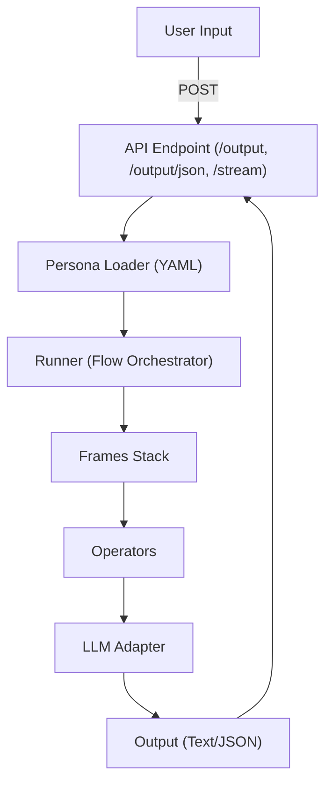

# ARCHITECTURE.md

# RASA Architecture: Role-Aligned Software Architecture

---

## 1. Overview

RASA is a framework for building persona-driven, memory-aware AI agents using modular components and explicit cognitive flows.  
It is designed to be:

- **Persona-driven**: Each agent's reasoning is governed by a declarative persona YAML (defining frames, operators, and metadata).
- **Memory-integrated**: Short-term, session, and long-term memory are first-class citizens, with extensible storage backends.
- **Composable & Extensible**: New personas, frames, operators, and tools are plug-and-play, supporting domain-specific and cross-domain use.
- **Interface-neutral**: Agents can be exposed via APIs, CLI, or imported directly as a Python library.

---

## 2. Key Concepts

### **Persona**
A declarative config (YAML) that defines an agent’s:
- **name, alias, description**
- **frames**: Execution stack (the “cognitive layers”)
- **operators**: Reasoning modules/tools
- **metadata**: Tone, domain, preferred sources, traits, etc.
- **prompt_style**: Output style (default, scientific, etc.)

### **Frame**
A Python class that represents a cognitive processing step (e.g., stateless, session, short-term memory).  
Frames can be core (provided by RASA) or domain-specific (in app folders).

### **Operator**
A Python class or function that performs a reasoning or transformation step (e.g., critique, explanation, external data fetch).

### **Runner**
Coordinates loading personas, instantiating frames/operators, and orchestrating flow for a given input or session.

### **Memory**
RASA separates memory into:
- **Stateless** (no memory, pure reasoning)
- **Short-term** (per interaction or conversation)
- **Session** (multi-turn, single user/session)
- **Long-term** (persistent knowledge, e.g. vector DB)

---

## 3. Directory Structure

```
project_root/
│
├── rasa/
│   ├── core/         # Core logic: runner, agent, memory, persona class
│   ├── api/          # FastAPI app (entry: rasa/api/main.py)
│   ├── frames/       # Built-in frame classes (stateless, session, etc.)
│   ├── operators/    # Built-in operator classes (preference_agent, etc.)
│   ├── llm/          # LLM adapters and config [see ./rasa/llm/LLM_CONFIG.md]
│
├── clients/
│   ├── rasa.py       # Unified CLI (direct+API)
│   └── README.md     # CLI help & usage [see ./clients/README.md]
│
├── apps/
│   ├── <persona>/
│   │    ├── persona.yaml
│   │    ├── frames/
│   │    └── operators/
│   ├── README.md     # Persona/apps usage [see ./apps/README.md]
│   ├── PERSONA.md    # Persona YAML standards [see ./apps/PERSONA.md]
│
├── tests/            # Pytest suite (API, CLI, persona, frame/operator)
├── README.md         # Project onboarding & quick start [see ./README.md]
├── CHANGELOG.md      # Project history/changelog [see ./CHANGELOG.md]
├── ARCHITECTURE.md   # (You are here)
└── ...
```

---

## 4. Component Flow

### **API Mode (via FastAPI)**



- **Direct Mode**: CLI runs the same logic, just instantiates Persona/Runner classes locally.

---

## 5. Core Extensibility Points

- **Personas**: Add new `apps/<persona>/persona.yaml`
- **Frames**: Add to `rasa/frames/` or `apps/<persona>/frames/`
- **Operators**: Add to `rasa/operators/` or `apps/<persona>/operators/`
- **LLM Adapters**: Swap LLM provider in `rasa/llm/llm.py` or API config [see ./rasa/llm/LLM_CONFIG.md]
- **Memory Stores**: Plug in different memory backends (Redis, VectorDB, etc.)
- **Tools**: Integrate APIs or external data in operator modules

---

## 6. Persona YAML Example

See [./apps/PERSONA.md](./apps/PERSONA.md) for full details, but every persona declares:

```yaml
name: travel_concierge
description: Personalized travel advice and recommendations.
frames:
  - stateless_frame
  - session_frame
  - short_term_frame
  - long_term_frame
operators:
  - preference_agent
  - tone_formatter
prompt_style: default
metadata:
  tone: friendly
  domain: travel
  preferred_sources: ["Lonely Planet", "TripAdvisor"]
  traits: ["curious", "helpful"]
```

---

## 7. Best Practices

- **Use one app folder per persona** for isolation and easy swapping.
- **Re-use core frames/operators** for shared logic; put domain- or persona-specific logic under each app.
- **Prefer `frames:`** over `state_stack:` in YAML for new personas.
- **Document** every persona and operator for team onboarding.
- **Write tests** for new personas, frames, and operators (see `tests/`).

---

## 8. API Endpoints (Quick Reference)

| Endpoint          | Method | Description                                  |
|-------------------|--------|----------------------------------------------|
| `/output`         | POST   | Persona output, plain text                   |
| `/output/json`    | POST   | Persona output, structured JSON + metadata   |
| `/stream`         | POST   | Streamed output (word-by-word)               |
| `/persona`        | GET    | List all available personas                  |
| `/llm/info`       | GET    | LLM provider/config info                     |
| `/llm/health`     | GET    | Health check (LLM connection)                |
| `/status`         | GET    | Server and model status                      |

---

## 9. Testing

- **API**: `pytest tests/test_api_master.py -s`
- **CLI**: `pytest tests/test_cli_end_to_end.py -s`
- **Persona/unit**: `pytest tests/`

All core logic is designed for isolated, fast, deterministic testing. See each test file for coverage.

---

## 10. Extending RASA

- Add a new persona: create a folder under `apps/`, define your YAML, and add any custom frames/operators.
- Add new memory or LLM: subclass the relevant adapters in `rasa/core/` or `rasa/llm/llm.py`.
- Extend the API: add endpoints in `rasa/api/`.

---

## 11. Resources

- [./README.md](./README.md): Project intro & quick start
- [./CHANGELOG.md](./CHANGELOG.md): Changelog/history
- [./clients/README.md](./clients/README.md): CLI usage & options
- [./apps/README.md](./apps/README.md): Persona/app design
- [./apps/PERSONA.md](./apps/PERSONA.md): Persona YAML standards
- [./rasa/llm/LLM_CONFIG.md](./rasa/llm/LLM_CONFIG.md): LLM setup/config reference
- [tests/](./tests/): Test suites and onboarding for contributors

---

## 12. Contributors & Community

We welcome contributions of:
- New personas, frames, and operators
- Bugfixes and doc improvements
- Real-world domain tool integration

Open a PR or issue, or join our discussions!

---

**RASA empowers you to design AI agents that think and act in ways that match your domain, your values, and your users' needs.**

---
