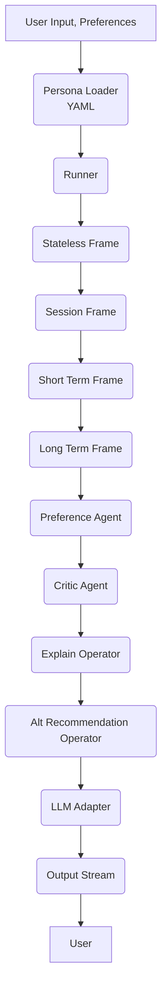

# RASA Deep Dive: The Strategic Stock Analyst (SSA) Persona

---

## 📌 Example Full-Stack Command

```bash
python -m clients.rasa --mode api run --persona strategic_stock_analyst   --input "Give me a detailed buy or sell recommendation for Nvidia, including current risks, valuation, sector trends, and alternative picks if I'm a cautious investor focused on technology or healthcare."   --preferences risk_tolerance=low --preferences sector=technology --preferences alt_sector=healthcare --stream
```

---

## 📝 Relating the Command to the Persona YAML

```yaml
name: strategic_stock_analyst
description: AI-powered analyst for stock advice, sector insights, and alternatives.
frames:
  - stateless_frame
  - session_frame
  - short_term_frame
  - long_term_frame
operators:
  - preference_agent
  - critic_agent
  - explain_operator
  - alt_recommendation_operator
prompt_style: detailed
metadata:
  tone: analytical
  domain: finance
  preferred_sources: ["Yahoo Finance", "Seeking Alpha", "Bloomberg"]
  persona_traits: ["cautious", "comprehensive"]
```

---

## 1️⃣ High-Level Flow: RASA SSA Persona



**Explanation:**
- Each box represents a frame (cognitive layer) or operator (reasoning tool).
- The flow moves left-to-right: input is progressively shaped and enriched before reaching the LLM.
- The output is delivered to the user, streaming if enabled.

---

## 2️⃣ Deep Dive: Advanced Orchestration with LLM, HITL, and Tools

```mermaid
flowchart TD
    subgraph UserInteraction
        A1[User Input/Preferences]
        A2[HITL Feedback (optional)]
    end

    subgraph PersonaStack
        B1(Persona Loader)
        B2(Runner)
        B3(Stateless Frame)
        B4(Session Frame)
        B5(Short Term Frame)
        B6(Long Term Frame)
    end

    subgraph Operators
        C1(Preference Agent)
        C2(Critic Agent)
        C3(Explain Operator)
        C4(Alt Recommendation Operator)
        C5[Tool Invocation (APIs, DB)]
    end

    subgraph LLM
        D1[LLM Adapter<br>(Ollama, OpenAI, etc.)]
        D2[LLM Response]
    end

    subgraph PostProcessing
        E1[Output Stream]
    end

    A1 --> B1
    B1 --> B2
    B2 --> B3
    B3 --> B4
    B4 --> B5
    B5 --> B6

    B6 --> C1
    C1 --> C5
    C5 --> C2
    C2 --> C3
    C3 --> C4
    C4 --> D1

    D1 --> D2
    D2 --> C2

    D2 --> E1
    E1 --> A1

    A2 --> B2
```

**Deep Dive Explanation:**
- **HITL (Human-in-the-Loop):** User feedback or overrides can flow back into the Runner for correction, re-prompting, or validation before final output.
- **Tools Layer:** `Tool Invocation` enables access to external APIs (e.g., Yahoo Finance) or databases. Tools can be called by operators as needed for richer, up-to-date information.
- **LLM Adapter:** Handles the prompt sent to the LLM provider (Ollama, OpenAI, etc.), abstracts away backend-specific logic.
- **LLM Response Loop:** Output can be reviewed by the Critic Agent, which may re-enter the LLM loop for refinement or further explanation.
- **Streaming:** Final output is delivered to the user, supporting real-time interaction.

---

## 🧠 Developer Notes

- **Persona Loader** parses the YAML and assembles the full stack (frames, operators, tools).
- **Runner** is the orchestrator, routing state and input through frames and invoking operators in order.
- **Frames** represent different memory and context layers. Each one can update or pass along "state".
- **Operators** act as reasoning steps and may call out to tools or external APIs.
- **LLM Adapter** manages prompt formatting, sending, and parsing LLM results.
- **HITL** enables robust QA, safety, or regulatory review before output—planned as part of the RASA design direction.

---

## 🚦 Current State & Aspirational Design

**This is the final architecture we aspire to fully realize with RASA.**
- Some components (e.g., full vector memory, multi-round HITL, advanced tool orchestration) may be in-progress or partially implemented.
- The design emphasizes maximum modularity and clarity for future contributors.

---

## 🔗 References

- [Persona YAML Spec](./apps/PERSONA.md)
- [LLM Config](./rasa/llm/LLM_CONFIG.md)
- [Architecture](./ARCHITECTURE.md)
- [CLI Usage](./clients/README.md)
- [Onboarding README](./README.md)
- [Sample Operators/Tools](./apps/strategic_stock_analyst/operators/)

---

*RASA: Building agents that reason, remember, and adapt—aligned with your real-world roles and domains.*

---
