# PERSONA_DESIGN.md

# RASA Persona Reasoning Flow – Developer Reference

---

## 📌 Example Full-Stack Command

```bash
python -m clients.rasa --mode api run --persona strategic_stock_analyst   --input "Give me a detailed buy or sell recommendation for Nvidia, including current risks, valuation, sector trends, and alternative picks if I'm a cautious investor focused on technology or healthcare."   --preferences risk_tolerance=low --preferences sector=technology --preferences alt_sector=healthcare --stream
```

---

## 📝 Relating the Command to the Persona YAML

```yaml
name: strategic_stock_analyst
description: AI-powered analyst for stock advice, sector insights, and alternatives.
frames:
  - stateless_frame
  - session_frame
  - short_term_frame
  - long_term_frame
operators:
  - preference_agent
  - critic_agent
  - explain_operator
  - alt_recommendation_operator
prompt_style: detailed
metadata:
  tone: analytical
  domain: finance
  preferred_sources: ["Yahoo Finance", "Seeking Alpha", "Bloomberg"]
  persona_traits: ["cautious", "comprehensive"]
```

---

## 1️⃣ High-Level Non-Linear Flow (SSA Persona)


**Explanation:**
- The Runner can send state to any frame (not strictly sequential).
- All frames can invoke the operators layer.
- Operators are the reasoning "toolbox" and call the LLM as needed.
- User, HITL, or feedback can re-enter the flow at the Persona Loader or Runner.

---

## 2️⃣ Detailed Nonlinear Deep-Dive Flow

```mermaid
flowchart TD
    %% Define color styles based on the provided green palette
    classDef input fill:#f0f8f3,stroke:#5b8772,stroke-width:2px,color:#2d4339
    classDef loader fill:#e0efe8,stroke:#5b8772,stroke-width:2px,color:#2d4339
    classDef runner fill:#d0e6dd,stroke:#5b8772,stroke-width:2px,color:#2d4339
    classDef frames fill:#c1ded3,stroke:#5b8772,stroke-width:2px,color:#2d4339
    classDef operators fill:#a1c9b9,stroke:#5b8772,stroke-width:2px,color:#2d4339
    classDef tools fill:#d0e6dd,stroke:#5b8772,stroke-width:2px,color:#2d4339
    classDef hitl fill:#5b8772,stroke:#2d4339,stroke-width:2px,color:#f0f8f3,font-weight:bold
    classDef llm fill:#81b59f,stroke:#5b8772,stroke-width:2px,color:#2d4339
    classDef output fill:#e0efe8,stroke:#5b8772,stroke-width:2px,color:#2d4339
    
    %% Core components
    A[User Input / Preferences]
    B(Persona Loader<br>YAML)
    C(Runner)
    
    %% Frames
    subgraph Frames["Frames"]
        F1(Stateless Frame)
        F2(Session Frame)
        F3(Short Term Frame)
        F4(Long Term Frame)
    end
    
    %% Operators
    subgraph Operators["Operators"]
        O1(Preference Agent)
        O2(Critic Agent)
        O3(Explain Operator)
        O4(Alt Recommendation Operator)
        O5[Tool/External API]
        O6[HITL / Feedback]
    end
    
    %% LLM
    LLM(LLM Adapter<br>Ollama, OpenAI)
    
    %% Outputs
    Output(Output Stream / API / CLI)
    
    %% Linear flow
    A --> B --> C
    C --> F1
    F1 --> F2
    F2 --> F3
    F3 --> F4
    
    %% Frames can invoke operators, LLM, tools, or HITL
    F1 -- Frame Logic --> O1
    F2 -- Preference & Context --> O2
    F3 -- State/Context --> O3
    F4 -- Memory Query --> O4
    
    %% Operators can call LLM, tools, or each other
    O1 -- Get User Prefs --> LLM
    O1 -- Needs Data --> O5
    O2 -- Critique LLM --> LLM
    O3 -- Explain/Justify --> LLM
    O4 -- Find Alternatives --> O5
    O2 -- Human Review? --> O6
    O3 -- Human Review? --> O6
    O4 -- Final Output? --> LLM
    
    %% LLM outputs can be fed back into operators, or passed to Output
    LLM -- LLM Response --> O2
    LLM -- LLM Response --> O3
    LLM -- LLM Response --> O4
    LLM -- Final Output --> Output
    
    %% HITL and tools can redirect flow
    O6 -- Correction/Feedback --> F3
    O5 -- Data/Insight --> O1
    
    %% Output can lead to user feedback
    Output -- User Followup --> A
    
    %% Apply classes
    class A input
    class B loader
    class C runner
    class F1,F2,F3,F4 frames
    class O1,O2,O3,O4 operators
    class O5 tools
    class O6 hitl
    class LLM llm
    class Output output
    
    %% Link styling
    linkStyle default stroke:#88888855,stroke-width:1.5px
```



---

## 📝 **Step-by-Step Reasoning Flow (with Branches & Feedback)**

### 1. **User Input / Preferences**
- User submits a query and optionally detailed preferences (risk, sector, goals, etc).
- Input is routed through API or CLI to the persona system.

### 2. **Persona Loader & Runner**
- Loads persona YAML (frames, operators, metadata).
- Runner creates the agent stack—frames, operators, tool links.

### 3. **Frames (Cognitive Layers)**
- **Stateless Frame:** Initial logic or prompt.
- **Session Frame:** Conversational context; can invoke operators.
- **Short Term Frame:** Aggregates state; invokes operators, tools, memory.
- **Long Term Frame:** Persistent memory, can influence prompt or operators.

**Nonlinear:**  
Any frame can:
  - Call operators, tools, LLM, or HITL
  - Pass state to any next frame or loop back for feedback

### 4. **Operators (Reasoning Tools)**
- **Preference Agent:** Enforces preferences, may call LLM or tools.
- **Critic Agent:** Reviews LLM output, may trigger HITL or re-prompt.
- **Explain Operator:** Adds justification (calls LLM, pulls memory).
- **Alt Recommendation Operator:** Finds alternatives (chains tools, LLMs).

**Operators can:**
  - Call LLM/tools/other operators
  - Pass output for HITL review

### 5. **LLM Adapter**
- Handles context-enriched prompts, can be invoked multiple times in a flow.
- Sends queries to LLM provider.
- Outputs go to operators or final output.

### 6. **Tool/External API Layer**
- Invoked for real-time data (finance, news, etc).
- Results flow back into frames, operators, or LLM prompt context.

### 7. **HITL (Human-in-the-Loop) Feedback**
- Can occur post-operator, post-LLM, pre-output, or as direct user feedback.
- May cause correction, clarification, or re-processing.

### 8. **Output**
- The final, fully processed response returns to user (CLI, API, or stream).
- User follow-ups can trigger new flows with session/long-term memory.

---

## 🔄 **Why This Design?**

- **Branching, non-linear:** No single path—frames, operators, tools, and LLM interact as needed.
- **Composable reasoning:** New tools, operators, feedback, or frames can be inserted with minimal code changes.
- **Modular extensibility:** Plug in new frames, swap LLM adapters, new APIs, or HITL policies.

---

## 🧑‍💻 **Developer Guidance**

- Write frames/operators as stateless, composable functions or classes.
- Use explicit state passing (dict/object) between steps.
- Document when/how each block is expected to call tools, LLM, or HITL.
- Use persona YAML as the orchestration/config layer for logic.

---

## ⚡ **Final Design Aspiration**

- This flow is the **blueprint for RASA**—complex feedback, HITL, and advanced tool orchestration may be partial or in-progress.
- The aim: a robust, extensible, real-world agent framework for enterprise and domain reasoning.

---

## 🔗 References

- [Persona YAML Spec](./apps/PERSONA.md)
- [LLM Config](./rasa/llm/LLM_CONFIG.md)
- [Architecture](./ARCHITECTURE.md)
- [CLI Usage](./clients/README.md)
- [Onboarding README](./README.md)
- [Sample Operators/Tools](./apps/strategic_stock_analyst/operators/)

---

*RASA: Building AI agents that reason, remember, adapt, and integrate human judgment—aligned with your real-world roles and needs.*

---
